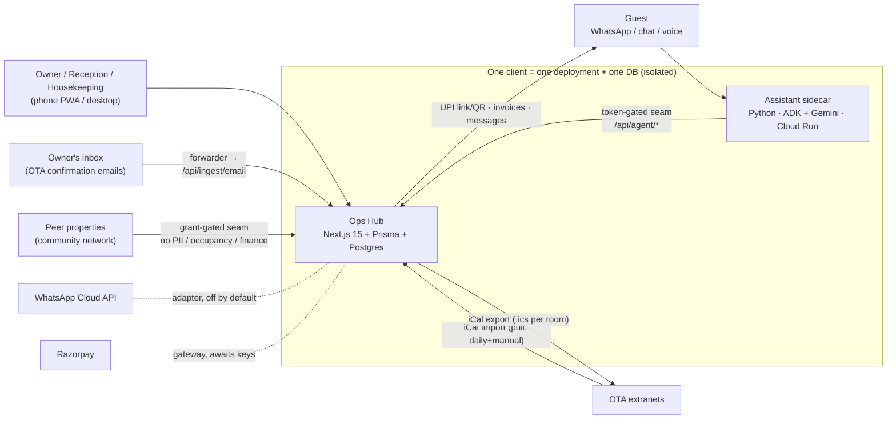

# Software Requirements Specification (SRS)
## Guest House Operations Hub — ROOT Platform PMS Layer

| | |
|---|---|
| **Document** | SRS-GHOH-001 · v1.0 · 2026-07-16 |
| **Standard** | Structured per IEEE 29148/830 principles, adapted |
| **Traceability** | FR/NFR IDs here are referenced by the Backlog (doc 14), RTM (doc 15), Business Rules (doc 05) and Tests (doc 16) |
| **Status** | DRAFT — items tagged `[OPEN-Q]` are blocked on the Stakeholder Question Log (doc 09) |

---

## 1. Introduction

### 1.1 Purpose
Specify, to implementation-ready precision, the requirements for the Guest House Operations Hub so that a new engineering team can build, harden, and operate it without further clarification beyond the identified open questions.

### 1.2 Scope
Covers the operator web application (PWA), its API surface, the AI-agent seam, ingestion/sync integrations (email, iCal), the community network, and the operational envelope (security, performance, backup, monitoring). Excludes the AI assistant's internal runtime (separate service) and live cab dispatch.

### 1.3 Definitions
| Term | Meaning |
|---|---|
| **OTA** | Online Travel Agency (Booking.com, Agoda, MakeMyTrip) |
| **Channel** | Origin of a booking (Direct, WhatsApp, Website, each OTA); carries a commission % |
| **Travel agent** | B2B person bringing bookings for commission; distinct from channel and referral |
| **Stay** | Half-open date range `[check-in, check-out)` stored as Postgres `DATERANGE` |
| **Block** | A room held out of service for a period (maintenance, owner use, iCal-imported busy dates) |
| **Derived availability** | Free units = units − overlapping confirmed reservations − overlapping blocks; never a stored counter |
| **HITL** | Human-in-the-loop: AI files escalations; a human commits sensitive actions |
| **Seam** | The token-gated API surface (`/api/agent/*`, `/api/ingest/*`) external services use |
| **Client vs. property** | A *client* (owner business) gets an isolated deployment+DB; one client may run multiple *properties* inside it |
| **C-Form / Form C** | Mandatory registration of foreign guests with Indian authorities (FRRO) |
| **UTR** | Unique Transaction Reference for UPI/bank transfers |
| **DPDP** | India's Digital Personal Data Protection Act, 2023 |

### 1.4 System context

### 1.5 Constraints (binding)
| ID | Constraint | Source |
|---|---|---|
| C-01 | No OTA extranet scraping/automation; ingest only via owner inbox + official iCal | Hard rule |
| C-02 | No direct OTA connectivity APIs (unavailable to single properties) | Hard rule |
| C-03 | Availability always derived; never a mutable counter | Hard rule |
| C-04 | DB GiST exclusion constraint `no_overlapping_confirmed_stays` must never be weakened | Hard rule |
| C-05 | No secrets in code; `.env` git-ignored | Hard rule |
| C-06 | Stack: Next.js 15 App Router, TypeScript strict, Postgres (Supabase), Prisma, Tailwind v4, Zod, Vitest; migrations only via `db:migrate:new` (Prisma diff engine mangles DATERANGE/GiST) | README/ROADMAP |
| C-07 | One client = one deployment + one database + one agent; nothing shared across clients | ROADMAP |
| C-08 | AI agents never write money or calendar directly; sensitive actions escalate to a human | INTEGRATION design |
| C-09 | Proactive WhatsApp sends require Meta-approved templates (free text only inside 24h window) | Meta policy `[FACT]` |

---

## 2. Product Overview

### 2.1 Users and roles `[FACT]`
| Role | Access |
|---|---|
| Owner | Everything, incl. Finance, Pricing, Analytics, Settings, community, multi-property switch |
| Reception | Bookings, guests, day-to-day ops; **no** money or setup |
| Housekeeping | Today + Cleaning only |

`[GAP]` Role model is page/route-level; field-level money masking in API responses is missing (staff-visible responses can carry `grossAmount`) — see NFR-SEC-07, GAP-12.

### 2.2 Operating environment
Mobile-first PWA (~390 px baseline) installable to home screen; desktop sidebar layout; intermittent-connectivity tolerance claimed (`[OPEN-Q Q-TEC-04]` on actual offline depth); reference hosting Vercel + Supabase + GitHub Actions + Vercel Cron; DigitalOcean branch exists.

---

## 3. Functional Requirements

> Numbering: FR-<MODULE>-<n>. Priority: **M**ust / **S**hould / **C**ould / **W**on't (this release). Status: ✅ built (per README/ROADMAP, verify in code) · 🟡 groundwork/off-by-default · ✖ missing.
> Full behavioural detail (inputs/outputs/pre/postconditions/exceptions) is in doc 03 Module Analysis; business rules in doc 05.

### 3.1 Authentication & user management (AUTH)
| ID | Requirement | Pri | Status |
|---|---|---|---|
| FR-AUTH-1 | Email+password login with scrypt hashing; session persists ~1 month ("stay logged in") | M | ✅ |
| FR-AUTH-2 | Login rate-limiting 10 attempts/IP/5 min | M | ✅ (per-instance store — see NFR-SEC-05) |
| FR-AUTH-3 | Owner creates staff logins and assigns role + per-property access | M | ✅ |
| FR-AUTH-4 | Self-service password reset (email OTP/link) | M | ✖ GAP-10 |
| FR-AUTH-5 | User invitation flow (no owner-set passwords) | S | ✖ GAP-10 |
| FR-AUTH-6 | Session revocation on role change/disable; audit of auth events | M | `[OPEN-Q Q-SEC-03]` |
| FR-AUTH-7 | Optional 2FA for owner accounts | C | ✖ |

### 3.2 Property & multi-property (PROP)
| ID | Requirement | Pri | Status |
|---|---|---|---|
| FR-PROP-1 | Property profile: name, address, GST number, check-in/out times, currency, UPI ID, ID-rule strictness (block/warn/off), ID-number-at-booking toggle, ID-scan retention days | M | ✅ |
| FR-PROP-2 | Owner adds properties; switcher appears at 2+; all screens re-scope to acting property | M | ✅ |
| FR-PROP-3 | Guests shared owner-wide; bookings/pricing/finance strictly per-property | M | ✅ (decision 2026-07-15) |
| FR-PROP-4 | Staff property-access editable per user | M | ✅ |
| FR-PROP-5 | All tenant tables carry `propertyId`; auto-scoping Prisma extension; raw SQL must scope by hand | M | ✅ (fragile — NFR-SEC-06) |

### 3.3 Rooms & room types (ROOM)
| ID | Requirement | Pri | Status |
|---|---|---|---|
| FR-ROOM-1 | Room types: name, base rate, max occupancy, rate floor/ceiling | M | ✅ |
| FR-ROOM-2 | Rooms belong to a type; label; archive (retire, keep history); delete only if never booked | M | ✅ |
| FR-ROOM-3 | Amenities per room type (feeds community directory) | S | ✅ |

### 3.4 Availability engine (AVAIL)
| ID | Requirement | Pri | Status |
|---|---|---|---|
| FR-AVAIL-1 | Availability derived: units − overlapping confirmed reservations − overlapping blocks, per room-type per date | M | ✅ |
| FR-AVAIL-2 | Two confirmed reservations for the same room can never overlap — enforced by Postgres GiST exclusion constraint, not app code | M | ✅ |
| FR-AVAIL-3 | Exclusion-constraint violations surfaced as clean 409 "dates no longer available" (never raw 500) | M | ✅ |
| FR-AVAIL-4 | Cancelled bookings free their dates immediately | M | ✅ |
| FR-AVAIL-5 | Optional oversell safety buffer per room type (don't offer last N units to OTAs/agents) | S | ✖ GAP-24 (User Guide *advises* a manual buffer; no feature exists) |

### 3.5 Booking engine (BOOK)
| ID | Requirement | Pri | Status |
|---|---|---|---|
| FR-BOOK-1 | Create booking: guest (dedupe by phone), channel, room, dates, arrival time, amount (pre-filled by pricing suggestion), special requests, optional travel agent, ID-confirmation tick | M | ✅ |
| FR-BOOK-2 | Blacklist and scam-number warnings shown at entry; proceed allowed (warn-only) | M | ✅ |
| FR-BOOK-3 | Edit, cancel (frees dates; computes ladder refund), undo of check-in/out steps | M | ✅ |
| FR-BOOK-4 | Statuses: confirmed / cancelled / no_show; check-in/out as timestamps | M | ✅ |
| FR-BOOK-5 | All-bookings list: instant search (guest/phone/room/channel), timeline filters with counts | M | ✅ |
| FR-BOOK-6 | Group/long-stay folio linking multiple room bookings for combined view + billing | S | ✅ (billing depth `[OPEN-Q Q-OPS-06]`) |
| FR-BOOK-7 | Hold-a-room-while-paying (gateway hold with deadline, reusing the exclusion constraint) | S | 🟡 awaits Razorpay keys |
| FR-BOOK-8 | Walk-in same-day booking fast path | S | `[INFERRED as covered by FR-BOOK-1; verify UX]` |
| FR-BOOK-9 | No-show marking rules (when, by whom, revenue/refund effect) | M | `[OPEN-Q Q-OPS-04]` — status exists; policy undefined |

### 3.6 Calendar (CAL)
Rooms × dates grid; Day/Week/2-Week/Month; colour code vacant/occupied/blocked/conflict/arriving/departing; continuous stay bars with guest+channel; tap-to-book empty nights; date jump; conflict cells red. All ✅ `[FACT]`.

### 3.7 OTA ingestion — email (INGEST)
| ID | Requirement | Pri | Status |
|---|---|---|---|
| FR-ING-1 | Paste OTA confirmation email → parse guest/dates/amount → staged `InboundBooking` under Pending review | M | ✅ |
| FR-ING-2 | Review, correct, pick room, create (conflict-checked) or dismiss; original email viewable | M | ✅ |
| FR-ING-3 | Token-gated webhook `POST /api/ingest/email` + Gmail Apps Script / Cloudflare Worker forwarders for automation; review step retained | M | 🟡 off by default |
| FR-ING-4 | Parser tuned per OTA format; unparseable emails staged raw with failure reason | M | 🟡 "tuning against real OTA emails remains" `[FACT]` |
| FR-ING-5 | Detect OTA **modification/cancellation** emails and link to the existing booking rather than staging a duplicate | M | ✖ GAP-2 (only confirmations mentioned) |
| FR-ING-6 | Duplicate suppression by `ota_ref` | M | `[INFERRED — ota_ref field exists; behaviour unverified]` |

### 3.8 iCal sync (ICAL)
| ID | Requirement | Pri | Status |
|---|---|---|---|
| FR-ICAL-1 | Import per-room OTA iCal URL; busy dates become blocks; manual Sync now + daily auto-refresh | M | ✅ |
| FR-ICAL-2 | Export per-room private `.ics` URL | M | ✅ |
| FR-ICAL-3 | Import failures (URL dead, feed malformed) alert the owner | M | ✖ GAP-5 |
| FR-ICAL-4 | Removed events in source feed release the corresponding blocks | M | `[OPEN-Q Q-TEC-06]` |
| FR-ICAL-5 | Per-feed tokens (rotate away from single iCal token) | S | ✖ (repo's own suggestion) |
| FR-ICAL-6 | Sync frequency configurable / more frequent than daily (lag window = oversell risk) | S | ✖ GAP-6 |

### 3.9 Guests & CRM (GUEST)
Profiles (name, phone unique, email, address, vehicle, notes, preferences/tags); stays, LTV, repeat badge; reliability score from no-shows + "repeat no-show" badge + shareable alert; ID flags (checked / photocopied / verification complete / consent) gating check-in; blacklist toggle+reason; ID document upload (🟡 storage env); C-Form section (13 nullable fields: nationality, passport, visa, port+date of entry, purpose); stay history. All ✅ except noted `[FACT]`.
| ID | Requirement | Pri | Status |
|---|---|---|---|
| FR-GST-1 | Guest merge (duplicate records, changed phone) | S | ✖ GAP-19 |
| FR-GST-2 | DPDP data-subject operations: export & delete a guest's data on request | M | ✖ GAP-8 |
| FR-GST-3 | C-Form output artefact (print/PDF/CSV in the format the FRRO process accepts) | M | ✖ GAP-7 — fields stored, no output `[OPEN-Q Q-LEG-02]` |

### 3.10 Check-in / check-out (CHECK)
Three-stage stay card (not arrived → in-house → checked out) with undo; check-in gated on ID verification (+C-Form for foreigners) per property strictness (block/warn/off); checkout feeds housekeeping. ✅ `[FACT]`.
`[OPEN-Q Q-OPS-03]`: is check-out allowed with balance due? Current behaviour unspecified.

### 3.11 Housekeeping (HK)
To-clean (post-checkout, "clean first" flag when same-day arrival) and Ready lists; manual "needs cleaning"; assignment to staff with checklist. ✅.
Missing `[REC]`: inspected/verified state; periodic deep-clean scheduling; block room while dirty option — GAP-20.

### 3.12 Pricing (PRICE)
Advisory rule engine — weekend, seasons/holidays list, early-bird/last-minute, occupancy/busy-period — compounded then clamped to type floor/ceiling; rate calendar with pinned overrides (dot) and rule-adjusted italics; suggestion pre-fills bookings; never pushed to OTAs; never rewrites saved bookings. ✅ `[FACT]`. Rule precedence/compounding order documentation ✖ — `[OPEN-Q Q-OPS-08]`.

### 3.13 Payments (PAY)
| ID | Requirement | Pri | Status |
|---|---|---|---|
| FR-PAY-1 | Multiple payments per booking; modes cash/UPI/card/bank/OTA-collect; balance due derived | M | ✅ |
| FR-PAY-2 | Advance tracking: `advanceRequired` + `isAdvance` payments; status derived | M | ✅ |
| FR-PAY-3 | UPI/bank verification checklist (sender name, funds landed, UTR reference) gating Add payment | M | ✅ |
| FR-PAY-4 | UPI pay link + self-contained QR for outstanding balance (no gateway) | M | ✅ |
| FR-PAY-5 | Razorpay auto-capture + idempotent webhook + room hold | S | 🟡 awaits keys |
| FR-PAY-6 | Refund workflow on cancellation per ladder; owner may approve a different amount; refund recorded with status | M | ✅ (payout execution manual `[INFERRED]`) |
| FR-PAY-7 | Payment edit/void with audit trail | M | `[OPEN-Q Q-FIN-04]` |
| FR-PAY-8 | Money as integer paise or decimal (replace whole-rupee `number` math) | M | ✖ GAP-9 |

### 3.14 Invoicing (INV)
Printable invoice (property name/address/GST no., stay, charges, payments, balance) via browser Print→PDF. ✅.
Missing for GST compliance `[REC]`: sequential invoice numbering series, GST rate application per line / tariff slab, SAC code, place of supply, server-side PDF for consistency — GAP-11 `[OPEN-Q Q-FIN-02]`.

### 3.15 Finance (FIN)
Date-ranged tiles (Net to you / Gross / Commission / Outstanding); by-channel breakdown; expenses; balances due; Bookings/Payments CSV. ✅.
`[OPEN-Q Q-FIN-01]`: commission basis (gross vs net-of-GST; MMT net-rate vs commission models). `[OPEN-Q Q-FIN-03]`: OTA payout reconciliation (recording when the OTA actually pays) ✖ GAP-13.

### 3.16 Analytics (ANLY)
Occupancy, ADR, RevPAR, average stay, cancellation rate, channel mix; occupancy trend, source-mix donut, revenue-by-channel charts; full CSV export. ✅.

### 3.17 Staff / attendance / shifts (STAFF)
Directory (name/role/phone), edit/disable/delete; shift roster; daily attendance present/absent/leave; housekeeping assignment. ✅. Payroll linkage ✖ (out of scope? `[OPEN-Q Q-OPS-09]`).

### 3.18 Facilities (FAC)
Maintenance requests (priority/assignee/cost, open→in-progress→done); asset register with service-every-N-days + due flag; inventory items (unit, low-stock level, in/out movements, low banner); vendors (+rating); purchase orders draft→ordered→received; vendor payments + summary; tour partners (commission %), tours, tour bookings + revenue/commission summary; drivers + trips (records only). All ✅.

### 3.19 Complaints & reviews (CRR)
Complaints: category, priority, assignee, status to resolved with follow-up; filters. Reviews: request tracking + response drafting. ✅.

### 3.20 Messaging (MSG)
| ID | Requirement | Pri | Status |
|---|---|---|---|
| FR-MSG-1 | Outbox logs every outbound message (channel, recipient, text, status) | M | ✅ |
| FR-MSG-2 | Auto-drafts: booking confirmation, pre-arrival (day before), payment reminders | M | ✅ (logged only) |
| FR-MSG-3 | WhatsApp Cloud API adapter flips status to sent/failed when enabled | M | 🟡 needs credentials + approved templates |
| FR-MSG-4 | Template management + params through the seam; language variants (Khasi/Hindi/English) | M | ✖ GAP-3 |
| FR-MSG-5 | Inbound guest replies visible to the operator (two-way thread) | S | ✖ GAP-4 — outbox only `[OPEN-Q Q-AI-04: or is two-way owned by the assistant?]` |

### 3.21 AI agent seam & escalations (AGENT)
| ID | Requirement | Pri | Status |
|---|---|---|---|
| FR-AGT-1 | Token-gated (`AGENT_TOKEN`, fail-closed) endpoints: availability, quote, create reservation (same GiST transaction, 409 on overlap), queue message, file escalation | M | ✅ |
| FR-AGT-2 | Escalation queue: source/category/severity tags, guest original message + AI summary, open→in-progress→resolved; linked booking actions done via normal screens | M | ✅ |
| FR-AGT-3 | Owner-editable runtime policies (Settings → Assistant rules), applied ~1 min, no redeploy | M | ✅ |
| FR-AGT-4 | Guest/owner persona isolation; canonical security block outranks owner policies; model fallback chain; per-turn diagnostics | M | ✅ (in sidecar) |
| FR-AGT-5 | Escalation SLA / notification to owner's phone when an escalation arrives | M | ✖ GAP-14 (badge only; no push) |
| FR-AGT-6 | Property-aware agent requests; booking derives property from room | M | ✅ |

### 3.22 Community network (COMM)
Connect via code; per-peer share switches (rooms, referrals, scam numbers, bad-guest alerts, vendors, drivers); directory by amenities; overflow referrals with accept→book (conflict-checked)→attributed revenue→derived reciprocal-credit ledger; verified scam/bad-guest sharing (evidence required, dispute/appeal, auto-expiry, hashed number matching); shared vendor/driver lists; all opt-in; never shares guest PII, occupancy, or finance; single audited grant-gated seam. ✅ `[FACT]`.
| ID | Requirement | Pri | Status |
|---|---|---|---|
| FR-COM-1 | Credit-ledger settlement/dispute mechanism (what happens when balances grow one-sided) | S | `[OPEN-Q Q-BUS-06]` |
| FR-COM-2 | Network governance: who moderates disputed reports across independent deployments; where does the shared registry live | M | `[OPEN-Q Q-LEG-03]` — cross-deployment architecture unclear `[INFERRED]` |

### 3.23 Settings, import, audit (SET)
All settings sections per User Guide table ✅; CSV import of past guests/bookings (conflict-checked per row) ✅; audit log of sensitive actions (cancellations, refunds, blacklisting, user & consent changes) ✅.
`[REC]` Audit coverage should extend to: payment edits, price overrides, settings changes, community shares, ID views/downloads — GAP-15.

### 3.24 Offline & sync (OFFLINE)
User Guide claims: offline changes saved and synced on reconnect; conflicting offline bookings surfaced. Depth unverified `[OPEN-Q Q-TEC-04]` — the honest spec (queue? cache-only? which screens?) must come from code audit; treat as 🟡.

### 3.25 Localization (L10N)
| ID | Requirement | Pri | Status |
|---|---|---|---|
| FR-L10N-1 | Operator console i18n framework; Khasi + English UI (Hindi S) | S→M for inclusion goals | ✖ GAP-16 `[INFERRED — guide is English-only]` |
| FR-L10N-2 | Guest-facing artefacts (messages, invoices) language selection | S | ✖ |
| FR-L10N-3 | AI assistant Khasi/Hindi/English voice+text | M | ✅ (sidecar) `[FACT — pitch]` |

---

## 4. Non-Functional Requirements

### 4.1 Security
| ID | Requirement | Status |
|---|---|---|
| NFR-SEC-01 | Passwords scrypt-hashed; sessions HTTP-only; secrets via env only | ✅ |
| NFR-SEC-02 | All external seams token-gated, fail-closed | ✅ |
| NFR-SEC-03 | Cross-client isolation absolute (separate deployments/DBs) | ✅ by architecture |
| NFR-SEC-04 | In-client tenant isolation: Prisma auto-scoping + hand-scoped raw SQL | ✅ but fragile — add Postgres RLS as defence-in-depth (GAP-12) |
| NFR-SEC-05 | Rate limiting on shared store (Upstash/Redis) — per-instance memory is weak on serverless | ✖ known debt |
| NFR-SEC-06 | Lint/CI guard for raw SQL missing `property_id` scope | ✖ `[REC]` |
| NFR-SEC-07 | Field-level authorization: money fields masked server-side for non-owner roles | ✖ known debt |
| NFR-SEC-08 | ID documents: private bucket, signed URLs, access logged, encrypted at rest | 🟡 partial (adapter exists; logging unverified) |
| NFR-SEC-09 | Community hashed-number matching resistant to trivial re-identification (peppered/keyed hash — phone numbers are low-entropy; plain hashing is reversible by enumeration) | `[OPEN-Q Q-SEC-05]` `[REC]` |
| NFR-SEC-10 | Dependency and secret scanning in CI; security headers (CSP etc.) | `[OPEN-Q]` unverified |

### 4.2 Privacy & compliance
| ID | Requirement | Status |
|---|---|---|
| NFR-PRV-01 | DPDP 2023: lawful-purpose notice, recorded consent (exists ✅), data-principal rights (access/correction/erasure ✖), breach notification procedure ✖, retention enforcement (purge cron exists but **inert until `idRetentionDays` set** — default should be a sane value, not indefinite `[REC]`) | Partial — GAP-8 |
| NFR-PRV-02 | Form C: capture ✅; artefact/submission support ✖ | GAP-7 |
| NFR-PRV-03 | GST-compliant invoices (numbering, tax lines) | GAP-11 |
| NFR-PRV-04 | Cross-border processing disclosure (Gemini/US cloud) in guest-facing notice | ✖ `[REC]` |
| NFR-PRV-05 | Data-processing terms between MindBit and each client (who is fiduciary vs processor) | `[OPEN-Q Q-LEG-01]` |

### 4.3 Performance & capacity
| ID | Requirement | Target `[REC — confirm]` |
|---|---|---|
| NFR-PRF-01 | Interactive screens on mid-range Android over 3G/4G | P75 < 2.5 s LCP |
| NFR-PRF-02 | Booking create round-trip | < 1.5 s P95 |
| NFR-PRF-03 | Calendar month view, 20 rooms | < 2 s P95 |
| NFR-PRF-04 | Scale envelope per client | ≤ 5 properties, ≤ 60 rooms, ≤ 30k reservations/yr — small by design; N+1s acceptable only inside this envelope |
| NFR-PRF-05 | Agent seam availability/quote | < 800 ms P95 (conversation latency budget) |

### 4.4 Availability & resilience
| ID | Requirement | Status |
|---|---|---|
| NFR-AVL-01 | Target 99.5% monthly availability per client `[REC]` | Undefined today |
| NFR-AVL-02 | Documented, **tested** backup & restore: daily automated backup, RPO ≤ 24h, RTO ≤ 4h, quarterly restore drill | ✖ GAP-1 (Supabase backups exist platform-side; procedure undocumented/untested `[INFERRED]`) |
| NFR-AVL-03 | Graceful degradation when sidecar/AI is down (hub fully usable; escalations queue) | ✅ by architecture `[INFERRED]` |
| NFR-AVL-04 | Cron failure (iCal sync, purge) detection & alert | ✖ GAP-5 |

### 4.5 Observability & support
| ID | Requirement | Status |
|---|---|---|
| NFR-OBS-01 | Error tracking (e.g. Sentry), structured logs, uptime checks per client deployment | ✖ GAP-17 |
| NFR-OBS-02 | Fleet dashboard: version, health, cron status across all client deployments | ✖ GAP-18 — critical for 25+ clients |
| NFR-OBS-03 | Support model: channel, hours, SLA, in-app "report a problem" | `[OPEN-Q Q-SUP-01]` |

### 4.6 Usability & accessibility
| ID | Requirement | Status |
|---|---|---|
| NFR-UX-01 | Mobile-first ~390 px; thumb-reachable primary actions; dark/light; density options | ✅ |
| NFR-UX-02 | Usable by non-technical operators; plain-language errors | ✅ intent; validate in pilot UAT |
| NFR-UX-03 | WCAG 2.1 AA for core flows (contrast, touch targets ≥44 px, screen-reader labels) | ✖ unassessed — GAP-21 |
| NFR-UX-04 | Low-literacy affordances (icons, voice via assistant) | `[REC]` future |

### 4.7 Maintainability & delivery
| ID | Requirement | Status |
|---|---|---|
| NFR-MNT-01 | CI: lint + typecheck + Vitest + agent pytest on PR | ✅ |
| NFR-MNT-02 | Route-level test for create-overlap→409; housekeeping derivation test | ✖ repo's own top gap |
| NFR-MNT-03 | Safe-migration discipline documented & enforced (CI check that migrations came from the helper `[REC]`) | Partial |
| NFR-MNT-04 | Fleet upgrade path: migrations run on deploy (`prisma migrate deploy`) ✅; coordinated multi-client rollout tooling ✖ GAP-18 |

---

## 5. External Interfaces
| Interface | Direction | Protocol | Notes |
|---|---|---|---|
| Owner inbox → hub | In | Email forwarder → HTTPS webhook (token) | Gmail Apps Script or Cloudflare Email Worker `[FACT]` |
| OTA iCal | In/Out | HTTPS `.ics` pull/serve | Binary busy/free, per room, hours-level lag; not offered on all listing types `[FACT]` |
| WhatsApp Cloud API | Out (in future?) | HTTPS | Template approval required; 24h session window `[FACT]` |
| Razorpay | In (webhook) / Out | HTTPS, idempotent webhook | Awaits merchant keys `[FACT]` |
| UPI deep link / QR | Out | `upi://` URI + SVG QR | No gateway; verification is manual checklist `[FACT]` |
| Agent sidecar | In | HTTPS, `AGENT_TOKEN` | availability/quote/reserve/message/escalate `[FACT]` |
| Peer deployments (community) | In/Out | Grant-gated seam | Exact cross-deployment topology `[OPEN-Q Q-LEG-03]` |
| Browser print | Out | CSS print | Invoices; server-side PDF deferred |

## 6. Data model
See doc 12 (entity catalogue + Mermaid ERD reflecting the 55-model schema). Correctness core: `Reservation.stay DATERANGE` + GiST exclusion (`WHERE status='confirmed'`), `Block.period DATERANGE`; availability computed, never stored.

## 7. Error handling principles
- Constraint violations → domain-specific 4xx with friendly copy (409 for overlap) — never raw 500 `[FACT]`.
- Consistent `{ data } / { error }` envelope `[FACT — convention]`.
- Parser failures stage the raw email rather than dropping it (FR-ING-4).
- Seam auth failures fail closed with no information leak.
- `[REC]` Add: global error boundary with user-visible incident ID; retry semantics documented per endpoint; webhook idempotency keys (Razorpay planned; extend to ingest).

## 8. Open items blocking final sign-off
The `[OPEN-Q]` tags above; consolidated with rationale in doc 09. The five that block the most design surface: Q-FIN-01 (commission basis), Q-LEG-02 (Form C artefact), Q-TEC-04 (offline truth), Q-LEG-03 (community topology), Q-BUS-03 (monetisation model).
