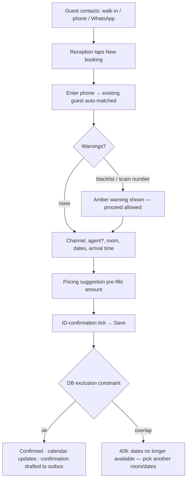
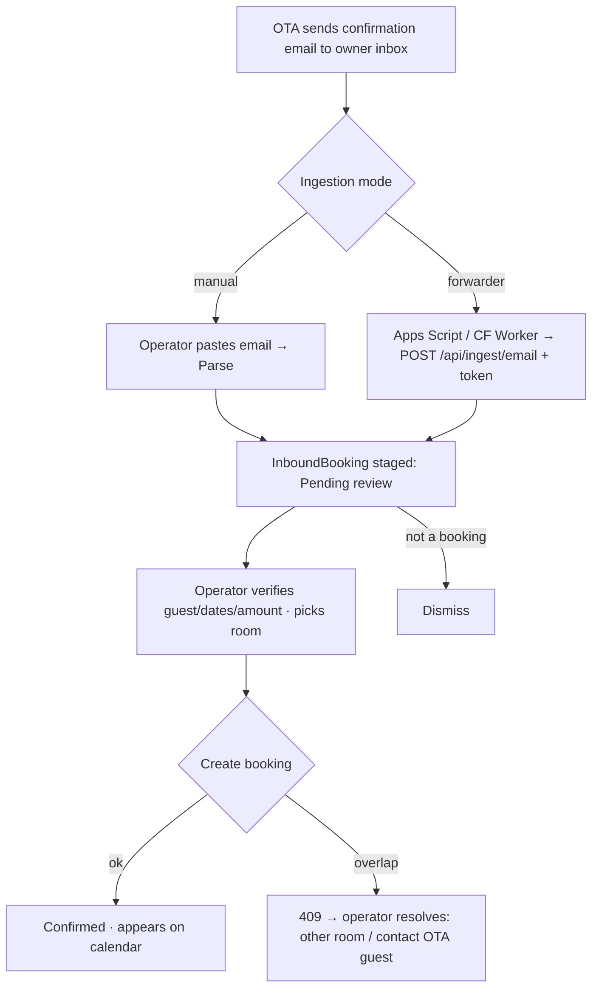
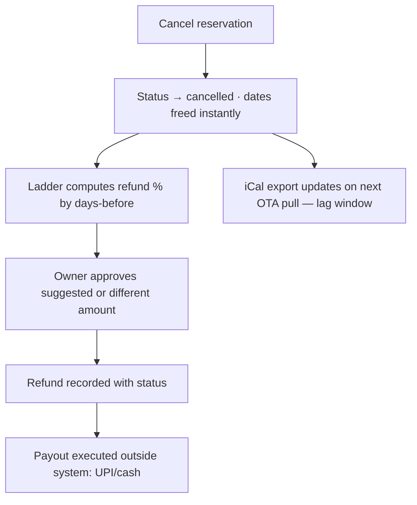
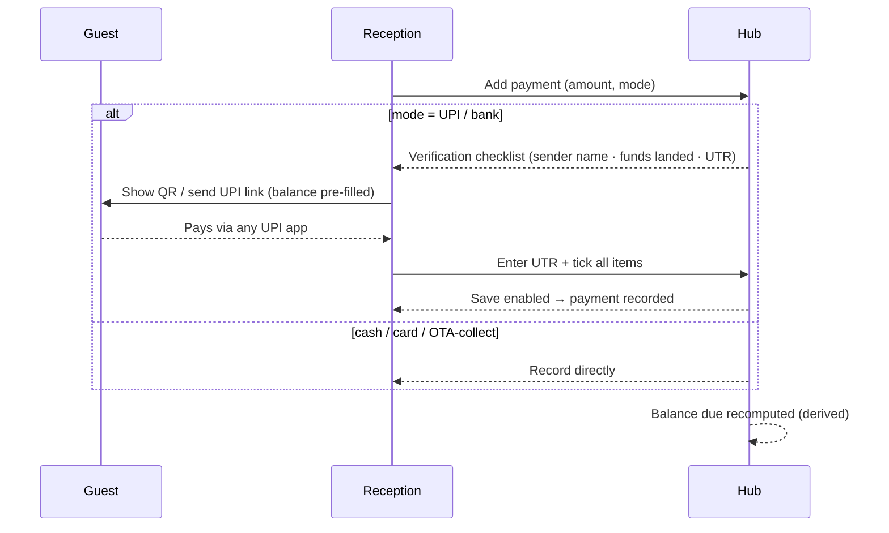
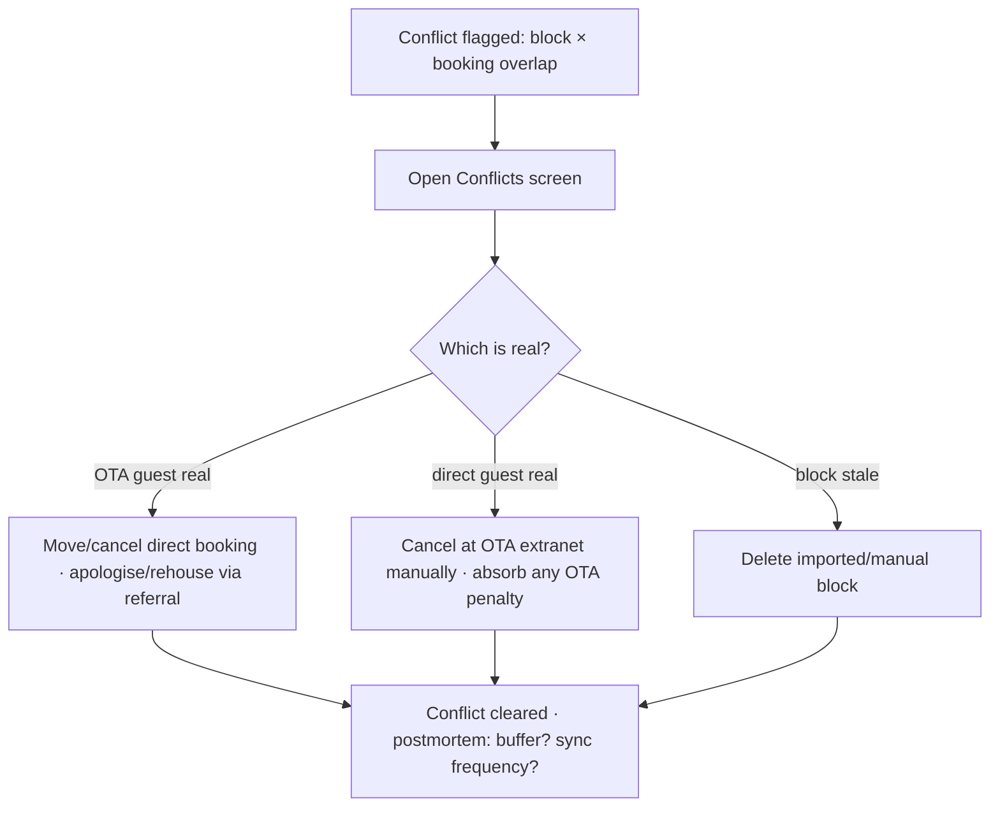
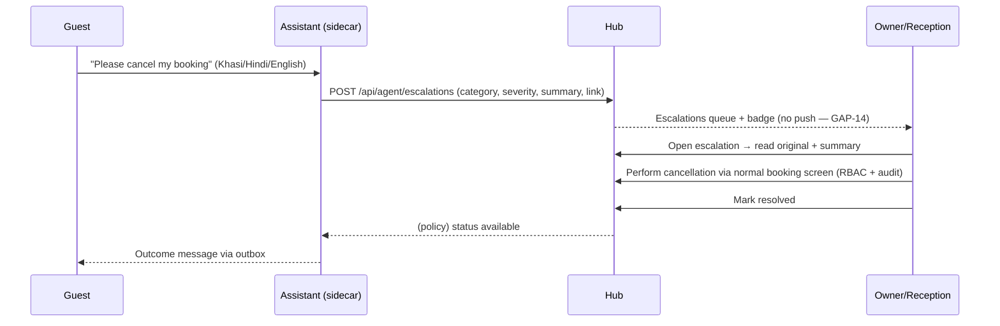

# Workflow Analysis
## Discovery doc 04 · v1.0 · 2026-07-16

Each workflow: happy path, alternate paths, failure paths, exception paths. Mermaid diagrams are the version-controllable source for process/sequence diagrams (deliverables "Process Flow Diagrams" and "Sequence Diagrams").

---

## WF-01 New direct booking

- **Happy:** as diagrammed; < 60 s target.
- **Alternate:** guest new (record created); agent-attributed; advance required (advance status pending until advance-tagged payment); booking taken by AI via seam (same constraint).
- **Failure:** overlap 409 (retry different room); validation errors inline.
- **Exception:** offline — queued locally, synced later; if it clashed meanwhile, app surfaces it (mechanics `[Q Q-TEC-04]`).

## WF-02 OTA booking import (email)

- **Failure:** parser can't extract → staged raw for manual entry; forwarder silently down → **no signal** (GAP-5: heartbeat needed).
- **Exception:** modification/cancellation email → **no linked-update path today** (GAP-2): operator must manually find & edit the booking. Duplicate email → suppress by ota_ref `[verify]`.

## WF-03 iCal sync cycle

- **Happy:** daily cron (+ manual Sync now) pulls each feed → busy events become blocks → export .ics serves our busy dates to OTA.
- **Failure:** fetch error → ? (no alert today, GAP-5); malformed feed → skip? partial apply? `[Q Q-TEC-06]`.
- **Exception:** imported block overlaps existing confirmed stay → **Conflict** flagged red → owner playbook: verify which guest is real, contact OTA, adjust (WF-12).
- **Exception:** event removed at source → block should be released (Q-TEC-06); if not, phantom-busy loses revenue.

## WF-04 Cancellation & refund

- **Alternate:** OTA-collect booking — OTA refunds guest per *their* policy; hub records for books only (Q-FIN-07). No-show: mark no_show — policy effects undefined (Q-OPS-04).
- **Failure:** refund > amount paid (guard `[R]`); cancel after check-in (allowed? `[Q]`).
- **Audit:** cancellation + refund are audited events `[F]`.

## WF-05 Guest arrival (check-in)

- **Happy:** Today list → booking → ID gate satisfied (ID number/scan/verified; consent; C-Form for foreigners) → Check in → in-house.
- **Alternate:** strictness=warn → proceed past missing ID with warning; strictness=off → no gate. Undo one step on mistake.
- **Failure:** ID gate blocks → Record ID link → capture → return.
- **Exception:** foreign guest not marked foreign → C-Form silently skipped (validation gap, Q-OPS-10); arrival before room clean → "clean first" flag in housekeeping.

## WF-06 Guest departure (check-out)

- **Happy:** settle balance (WF-07) → Invoice if wanted → Check out → room auto-appears in To-clean → clean → Mark clean → Ready.
- **Exception:** departure with balance due — allowed/blocked? (Q-OPS-03); late checkout — no fee construct (Q-OPS-11).

## WF-07 Payment collection (incl. scam guard)

- **Failure:** checklist unticked → Save disabled (fake-screenshot scam blocked) `[F]`.
- **Exception:** advance flow (Mark as advance); overpayment (undefined, Q-FIN-06).

## WF-08 Invoice generation
Booking → Invoice → print/Save-PDF. **Gaps:** no stored invoice record/number, no GST lines (GAP-11) — statutory workflow incomplete for GST-registered properties.

## WF-09 Cleaning workflow
Checkout (or manual flag) → To-clean (priority flag if same-day arrival) → assign staff + checklist → Mark clean → Ready. **Missing:** inspection step, block-if-dirty (GAP-20).

## WF-10 Inventory replenishment
Low-stock banner → PO draft → ordered → received (+ manual stock In) → vendor payment recorded → summary. **Gap:** received PO doesn't auto-move stock `[I verify]`.

## WF-11 Maintenance request
Log request (priority/assignee/cost) → in-progress → done; asset service-due flag → Serviced today resets. **Gap:** no auto room-block for disruptive repairs `[R]`.

## WF-12 Conflict resolution (cross-channel double-book)

This is the costliest failure mode the product manages; needs an owner playbook + (future) referral tie-in `[R]`.

## WF-13 Referral (community overflow)
Full property → Referrals → pick connected peer (rooms shared) → send guest details (consent point `[Q Q-LEG-05]`) → peer accepts → peer books normally (conflict-checked) → revenue attributed → reciprocal credit ledger updates (derived). **Failure:** peer declines/silent → timeout/reassign `[Q]`. **Exception:** disputes on attribution (Q-BUS-06).

## WF-14 AI escalation (HITL)

**Failure:** AI down → guest gets fallback/no reply; hub unaffected. **Exception:** severity high at 2 am → sits unseen until morning (GAP-14 is the fix).

## WF-15 Scam / bad-guest report (community)
Incident → local flag (scam number w/ reason) → optional share to network: evidence attached → verification → visible to granting peers (hashed match) → dispute/appeal possible → auto-expiry. **Governance owner for verification/adjudication undefined** (Q-LEG-03).

## WF-16 New client onboarding (MindBit fleet — missing workflow, GAP-18)
Target `[R]`: provision deployment+DB → seed → property wizard (profile, rooms, channels, policies) → CSV import → iCal/forwarder setup → staff logins → training (Khasi materials) → go-live checklist. Today: manual, undocumented — critical path for grant milestones.

## WF-17 Backup & restore (missing, GAP-1)
Target `[R]`: nightly automated backup per client → offsite copy → quarterly restore drill → documented RTO/RPO. Today: platform defaults, unverified.
