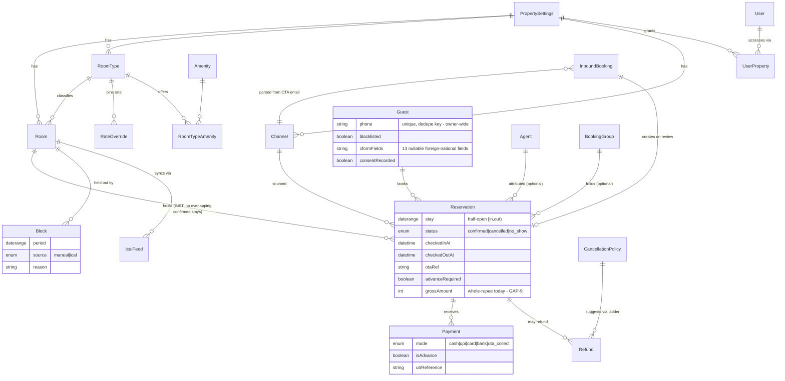
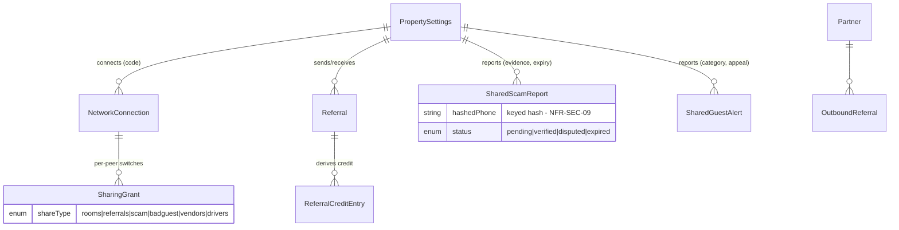
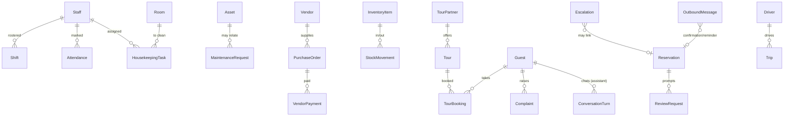

# Data Model & ERD
## Discovery doc 12 · v1.0 · 2026-07-16

**Source of truth:** `prisma/schema.prisma` (1,507 lines). The **entity names and enums below are extracted verbatim from the schema** `[FACT]`; attributes/relationships shown are those evidenced in ROADMAP/User Guide plus inference — full attribute-level verification is the first job of iteration 2 (Q-TEC-09).

## 1. Entity catalogue (grouped; 55 models, 27 enums `[FACT — grep]`)

| Domain | Models | Notes |
|---|---|---|
| **Identity & tenancy** | `User`, `UserProperty`, `PropertySettings` | `UserProperty` = per-property access grants. **No `Property` model found** — `PropertySettings` appears to be the property root (AMB-20/Q-TEC-09). Roles via `UserRole` enum |
| **Inventory of sellable space** | `RoomType`, `Room`, `Amenity`, `RoomTypeAmenity` | Type carries base rate, occupancy, floor/ceiling; room archivable |
| **Booking core** | `Reservation`, `Block`, `Channel`, `Agent`, `Guest`, `BookingGroup`, `InboundBooking` | `Reservation.stay` DATERANGE + GiST exclusion (`WHERE status='confirmed'`); `Block.period` DATERANGE; `InboundBooking` = staged OTA email; `BookingGroup` = folio |
| **Money** | `Payment`, `Refund`, `CancellationPolicy`, `Expense` | `PaymentMode` enum (cash/UPI/card/bank/OTA-collect); `RefundStatus`; advance derived from `Payment.isAdvance` + `Reservation.advanceRequired` |
| **Pricing** | `PricingPolicy`, `Season`, `RateOverride` | Advisory engine config |
| **Ops** | `HousekeepingTask`, `MaintenanceRequest`, `Asset`, `InventoryItem`, `StockMovement`, `Vendor`, `PurchaseOrder`, `VendorPayment` | Status enums per module |
| **People ops** | `Staff`, `Shift`, `Attendance` | AttendanceStatus enum |
| **Guest experience** | `Complaint`, `ReviewRequest`, `Tour`, `TourPartner`, `TourBooking`, `Driver`, `Trip` | Trip records only (dispatch external) |
| **Sync & ingestion** | `IcalFeed` | Import/export config per room; `InboundStatus` enum for staged emails |
| **AI & comms** | `Escalation`, `OutboundMessage`, `ConversationTurn`, `FaqEntry`, `AssistantPolicy`, `PushSubscription` | Escalation source/category/severity/status enums; `PushSubscription` present but wiring unverified (Q-TEC-08) |
| **Trust & safety (local)** | `FlaggedNumber`, `AuditEvent` | Local scam list; audit log |
| **Community network** | `NetworkConnection`, `SharingGrant`, `Partner`, `OutboundReferral`, `Referral`, `ReferralCreditEntry`, `SharedScamReport`, `SharedGuestAlert` | ShareType/ConnectionStatus/ReferralStatus/ScamReportStatus/GuestAlertStatus+Category enums; hashed matching |

**Multi-tenancy:** 55 occurrences of `propertyId` across the schema `[FACT — grep]`; auto-scoping Prisma extension; guests shared owner-wide (an explicit exception to per-property scoping) `[FACT]`.

## 2. Core ERD (booking correctness core + money)

## 3. Community-network ERD

## 4. Ops & AI satellite domains (compact)

## 5. Keys, constraints, integrity rules

| Concern | Position |
|---|---|
| Primary keys | Surrogate ids throughout (Prisma convention) `[I]` |
| The one constraint that matters | `no_overlapping_confirmed_stays` — GiST `EXCLUDE (room_id WITH =, stay WITH &&) WHERE status='confirmed'`; created via raw SQL migration; **never weaken** (C-04) `[FACT]` |
| Guest uniqueness | `phone` unique owner-wide `[FACT]`; normalization rule to define (E.164) `[R]` |
| Derived-only values | availability, balance due, advance status, agent commission owed, referral credit — **never stored** `[FACT]` — keep this doctrine for anything new `[R]` |
| Tenancy | `propertyId` on all tenant tables; Prisma extension auto-scopes; raw SQL hand-scoped (RSK-17); guests intentionally exempt (owner-wide) `[FACT]` |
| Money types | int whole-rupee today → integer paise migration (GAP-9) `[R]` |
| OTA ref | `otaRef` on Reservation — enforce uniqueness per channel for dedupe (BR-OTA-03) `[R — verify]` |

## 6. Normalization & denormalization
Schema is well-normalized with derived values computed at read time `[FACT/I]` — correct for this scale (NFR-PRF-04). **Deliberate denormalizations to consider later `[R]`:** (a) nightly-rate snapshot per reservation (GAP-22 — actually *adds* information, not denormalizes); (b) immutable `Invoice` snapshot entity (GAP-11 — required for statutory integrity, not performance); (c) materialized occupancy aggregates only if analytics slow beyond the envelope — not now.

## 7. Retention & archival
| Data | Rule today | Target `[R]` |
|---|---|---|
| ID documents | Purge cron exists; **inert until `idRetentionDays` set** (indefinite default) | Sane default (e.g. 180d) + owner notice |
| Guest PII | Indefinite | DPDP: erase-on-request (GAP-8) + inactivity review |
| Shared community reports | Auto-expire `[FACT]` | Keep; document period |
| Audit events | Undefined | ≥ 2y, append-only |
| Reservations/finance | Indefinite (books of account) | 8y per Indian accounting norms `[R — confirm with accountant]` |
| Messages/conversations | Undefined | 1y default, configurable |
