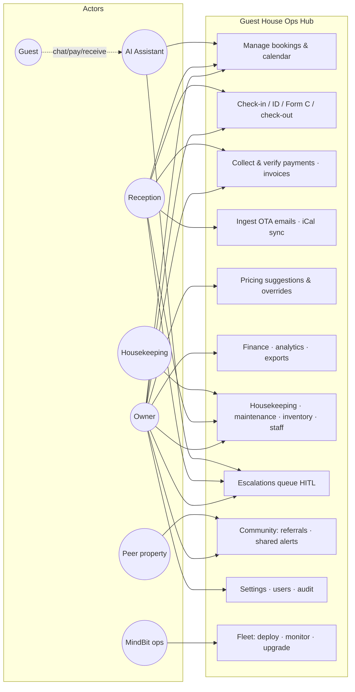

# Discovery Package — Guest House Operations Hub (ROOT)
### Full requirements analysis, gap analysis & implementation-ready specification
v1.0 · 2026-07-16 · Discovery Pass 1 (pre-codebase-audit)

**Sources analysed:** MindBit Pitch Deck (PRIME grant 2025–26) · USER-GUIDE · repo README.md · docs/ROADMAP.md · prisma/schema.prisma (entity inventory). The full codebase audit is **Iteration 2** and will convert remaining `[INFERRED]` items to facts.

**Method:** strict separation of `[FACT]` / `[INFERRED]` / `[REC]` / `[OPEN-Q]` throughout; no business rules invented — undefined behaviour is flagged as a stakeholder question, not assumed. Full traceability BO → FR/NFR → BR → GAP → US → TS via the RTM.

## Contents

| # | Document | What it answers |
|---|----------|-----------------|
| 01 | [BRD](01-BRD.md) | Business context, objectives, stakeholders, as-is/to-be, scope, success metrics |
| 02 | [SRS](02-SRS.md) | Functional + non-functional requirements with build-status; constraints; interfaces |
| 03 | [Module Analysis](03-module-analysis.md) | Every module dissected — inputs/outputs, validations, edge cases, risks |
| 04 | [Workflows](04-workflows.md) | 17 workflows with happy/alternate/failure/exception paths + Mermaid flow & sequence diagrams |
| 05 | [Business Rules Catalogue](05-business-rules.md) | ~70 rules with trigger/validation/result and status |
| 06 | [Gap Analysis](06-gap-analysis.md) | 30 prioritized gaps (S1–S4) with recommendations |
| 07 | [Risk Register](07-risk-register.md) | 32 risks with probability/impact/mitigation/owner |
| 08 | [Ambiguities](08-ambiguities.md) | 22 ambiguities with interpretations & decisions required |
| 09 | [Stakeholder Question Log](09-stakeholder-questions.md) | ~70 questions, grouped, each with rationale |
| 10 | [Assumptions Register](10-assumptions-register.md) | 18 assumptions with validation paths |
| 11 | [Dependencies Register](11-dependencies-register.md) | Internal/external/OTA/government/infra dependencies |
| 12 | [Data Model & ERD](12-data-model.md) | 55-model entity catalogue + Mermaid ERDs + retention rules |
| 13 | [API Analysis](13-api-analysis.md) | Existing seams + recommended surface, webhooks, events |
| 14 | [Backlog](14-backlog.md) | 9 epics, 45+ stories with G/W/T, points, DoR/DoD |
| 15 | [RTM](15-rtm.md) | Full traceability matrix |
| 16 | [Test Readiness](16-test-readiness.md) | Functional/UAT/security/perf/offline scenario catalogue |
| 17 | [Roadmap](17-roadmap.md) | Phase 0–3 plan aligned to grant quarters + future scope |

**Formats.** Every doc above ships as version-controlled Markdown (source of truth) **and** a styled HTML render (`.html`, same basename — branded document family, Mermaid diagrams render live). Plus:

| Artefact | File |
|---|---|
| **ER Diagram v1.0** — all 55 entities in 12 domain clusters (companion to doc 12) | [12-er-diagram.html](12-er-diagram.html) · 12-er-diagram.pdf |
| **Backlog workbook** — Jira/ADO-import-ready, epic summary formulas, DoR/DoD | 14-backlog.xlsx |
| **Question log (interactive)** — filter by group/★, type answers in-browser, print-friendly | [09-stakeholder-questions-interactive.html](09-stakeholder-questions-interactive.html) |
| **BRD & SRS, formatted** — cover page, TOC, styled tables, headers/footers | 01-BRD.docx / .pdf · 02-SRS.docx / .pdf |
| **Requirements deck** — 16 slides, document-family style, for reviews & grant conversations | Ops-Hub-Requirements-Deck.pptx |
| PDF render (Gap Analysis) | 06-gap-analysis.pdf |

Regenerate HTML/ERD/XLSX any time: `python3 assets/build_html.py · build_erd.py · build_backlog_xlsx.py`.

## System actors & use-case overview

## The five findings that matter most
1. **Correctness core is enterprise-grade** (DB-enforced no-double-booking, derived availability, HITL AI) — protect it; everything else can iterate.
2. **The binding constraint is operations, not features**: backup/restore, monitoring, fleet onboarding, and billing decide whether the 25-client grant plan survives (GAP-1/5/17/18/27).
3. **Legal posture needs a workstream now**: DPDP rights & retention, Form C artefact, GST invoices, community-network governance (GAP-7/8/11/26, RSK-04/05).
4. **Two contradictions need resolving on paper**: "self-hosted/locally-owned" vs US-cloud stack (AMB-01), and "money owner-only" vs reception recording payments (AMB-04).
5. **The costliest quiet failure mode** is OTA drift: modification emails with no linked-update path + silent sync failures (GAP-2/5) — both cheap to fix relative to the damage.

## How to use this package
1. Run the two workshops in doc 09 (owner-side, MindBit-side) — answer the ★ questions.
2. Commission Iteration 2 (codebase audit) against docs 02/03/12's `[INFERRED]` tags.
3. Adopt doc 17 Phase 0–1 as the immediate plan; import doc 14 into your tracker.
