# Guest House Ops Hub — User Guide

How to run the property day-to-day from your phone or computer. No technical knowledge needed.

This app is your single place to manage **bookings, the calendar, guests, housekeeping, pricing, money, your team, your facilities**, and even a **network of trusted nearby properties**. It works on a phone (it can be installed like an app) and on a computer. This guide walks through everything you'll do, screen by screen.

> A short version of this guide is built into the app — open **More → Help** on your phone, or the **Help** item in the sidebar on a computer.

## Contents

1. [Getting started](#getting-started)
2. [Today dashboard](#today-dashboard)
3. [Calendar](#calendar)
4. [Taking a booking](#taking-a-booking)
5. [A booking's details & check-in/out](#a-bookings-details--check-inout)
6. [Payments & invoices](#payments--invoices)
7. [Guests](#guests)
8. [Housekeeping](#housekeeping)
9. [Inbox (OTA emails)](#inbox-ota-emails)
10. [Pricing & rates](#pricing--rates)
11. [Finance](#finance)
12. [Analytics](#analytics)
13. [Conflicts](#conflicts)
14. [Channel feeds (iCal)](#channel-feeds-ical)
15. [All bookings (list)](#all-bookings-list)
16. [Travel agents](#travel-agents)
17. [Escalations & Messages](#escalations--messages)
18. [Team (Staff)](#team-staff)
19. [Facilities — maintenance, stock, vendors, tours](#facilities--maintenance-stock-vendors-tours)
20. [Complaints, reviews & groups](#complaints-reviews--groups)
21. [Community network](#community-network)
22. [Settings](#settings)
23. [Channels, OTAs & double-booking](#channels-otas--double-booking)
24. [Tips & FAQ](#tips--faq)

## Getting started

### Logging in

Open the app's web address and sign in with your email and password. Staying logged in keeps you signed in for about a month.

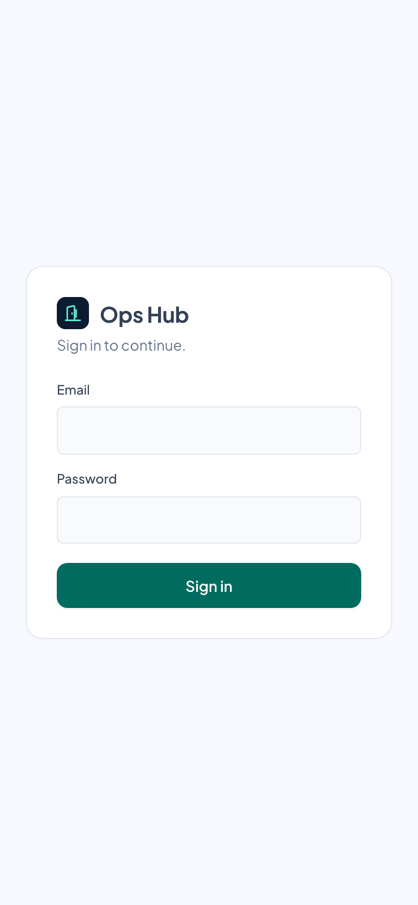

### Who can see what (roles)

Each login has a **role**, set by the owner in Settings → Users & roles:

- **Owner** — everything, including money (Finance, Pricing, Analytics) and Settings.
- **Reception** — bookings, guests and day-to-day work, but **not** money or setup.
- **Housekeeping** — just Today and Cleaning.

> **More than one property?** Owners who run several can switch between them from the property switcher at the top of the nav (it appears once you have 2+). Everything on screen then refers to the chosen property. Add a property in **Settings → Properties**.

### Finding your way around

- **On a phone:** a bar along the bottom shows **Today**, **Calendar**, a raised **+ New booking** button, **Bookings**, and **More**. Tap **More** for Guests, Housekeeping, Complaints, Staff, Needs you; the **Facilities** tools (Maintenance, Inventory, Vendors, Transport, Tours); Finance, Pricing, Analytics; the **Community** screens; Inbox, Messages, Escalations, Reviews; and Property setup and **Help**. Appearance, accent, density and the property switcher live in the Preferences (gear) menu, top-right.
- **On a computer:** the same destinations sit in a grouped sidebar down the left (Operate · Facilities · Business · Community · Review · Setup).
- The **New** button (top corner) starts a new booking from anywhere.

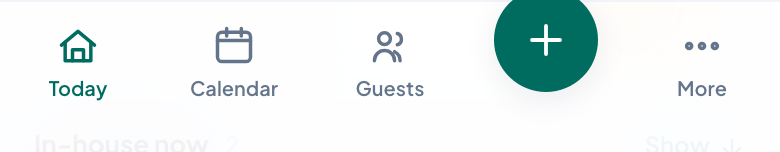

The phone menu's big **+** in the middle = new booking. **More** opens everything else (Finance, Pricing, Inbox, Settings, Help…).

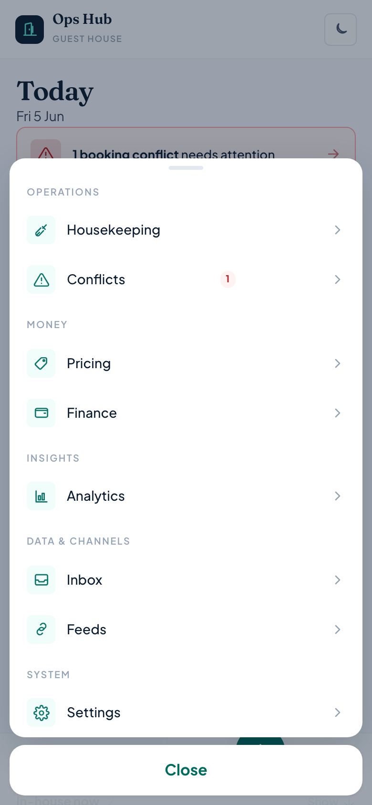

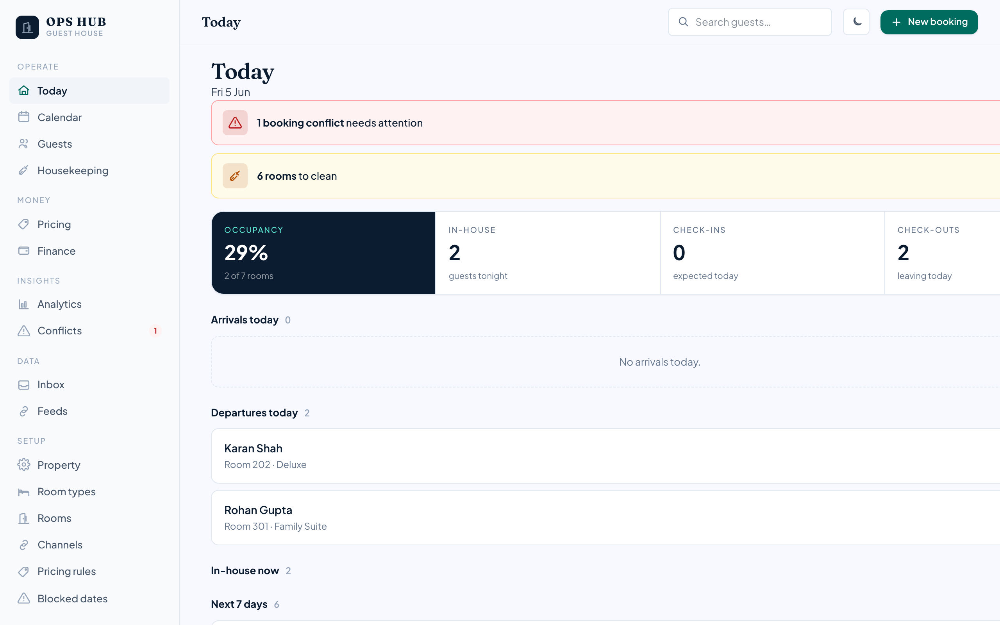

### Make it feel right

Tap the moon/sun icon to switch **dark / light** mode. Open **Preferences** (the gear, or *More → Preferences*) to change the **accent colour** and **display density** (comfortable / compact). Your choices are remembered on that device.

> **Install it like an app:** on a phone, use your browser's "Add to Home Screen". It then opens full-screen with its own icon, just like a native app.

## Today dashboard

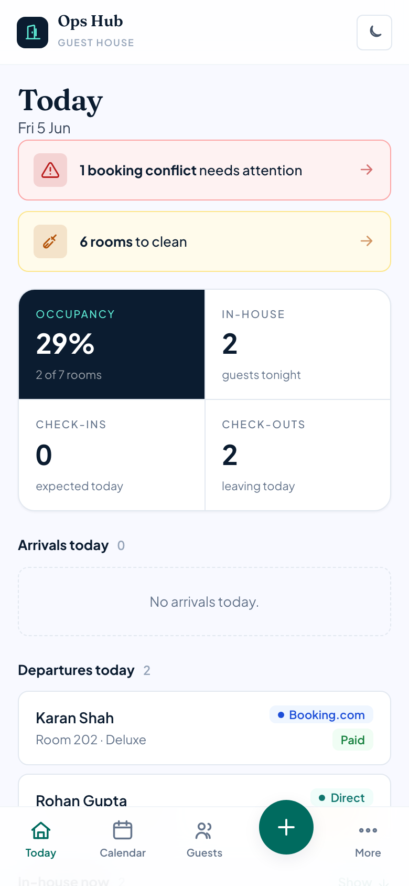

Your morning glance. It shows:

- **Occupancy**, **In-house**, **Check-ins** and **Check-outs** for today (the four tiles at the top).
- **Check-ins today** / **Check-outs today** — each guest shows *Arrived ✓ / Awaiting* and *Departed ✓ / Due out* so you can see who's still expected.
- **In-house now** and **Arrivals next 7 days**.
- If anything needs attention, a coloured banner appears at the top — e.g. "3 rooms to clean" or a booking "conflict". Tap it to jump straight there.
- **Pending payments** (owners only) — a card showing the total still owed across confirmed bookings; tap it to open Finance.

Tap any guest row to open that booking.

**Your day, start to finish:**

1. **Open Today** — see arrivals, departures, who's in-house, and any alerts.
2. **Check guests in** — as each arrives: open their booking → Check in.
3. **Check guests out** — as each leaves: open their booking → Check out.
4. **Clean rooms** — checked-out rooms appear in Housekeeping.
5. **Record payments** — log money received on each booking.

## Calendar

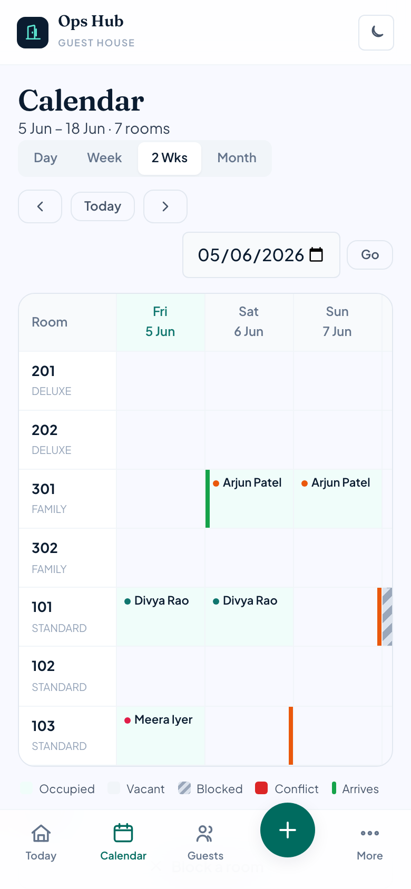

A grid of your rooms (rows) across dates (columns). Each stay draws as a continuous bar showing the guest and channel; empty nights are tap-to-book. Each cell is colour-coded:

| Colour | Meaning |
|---|---|
| Vacant | Room is free that night. |
| Occupied | A guest is staying — shows their name and the booking channel. Tap to open it. |
| Blocked | Held out of service (maintenance, repairs, owner use). |
| Conflict | A clash that needs fixing (e.g. a booking overlapping a block). Shown in red. |
| Arriving | A green edge marks the arrival day. |
| Departing | A clay edge marks the check-out day. |

### Moving around

- Switch the span with **Day** / **Week** / **2 Weeks** / **Month**.
- Use **‹** / **›** to page back/forward, **Today** to return to now, or pick a date and press **Go** to jump anywhere.
- Swipe sideways to see more dates.
- **Block a room** takes you to where you can hold a room out of service (Settings → Maintenance blocks).

## Taking a booking

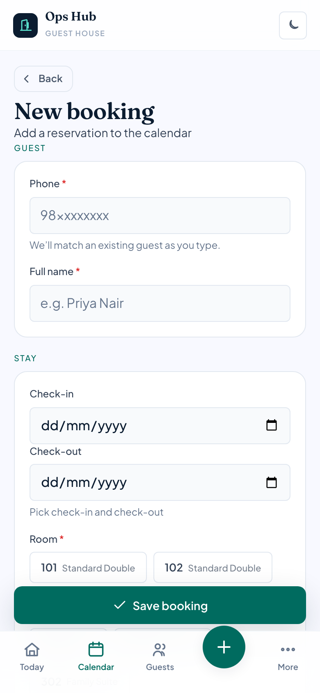

Tap **New** (or *New booking*). Fill in:

- **Guest name & phone** — if the phone matches an existing guest, their record is reused automatically.
- **Channel** (where the booking came from — Direct, WhatsApp, Website, etc.) and **Room**.
- **Travel agent** (optional) — if the booking came through an agent, pick them so their commission is tracked. Only shows once you've added agents (see [Travel agents](#travel-agents)).
- **Check-in / Check-out** dates, optional **arrival time**.
- **Amount** — if pricing rules are set up, a **suggested price** appears and pre-fills this for you (tap **Use** to accept, or type your own).
- **Special requests** — anything to remember.
- **ID confirmation** — tick the box confirming the guest has been told a valid ID will be collected at check-in. (The owner can relax or tighten this in Settings → Property.)

> **Double-booking is impossible.** If those dates for that room are already taken, the app refuses to save and tells you clearly — your calendar can never end up double-booked.

> If the guest is **blacklisted**, a warning shows with the reason. You can still proceed — it's just a heads-up.

> **Scam-number check.** As you type the phone, the app checks it against your **scam / flagged-numbers list** (Settings → Scam numbers). If it's a known-bad number, an amber warning appears so you can verify before taking the booking or any payment.

## A booking's details & check-in/out

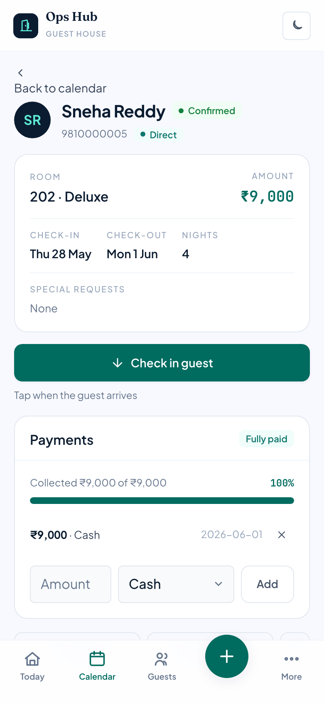

Tap any booking (from the calendar, Today, or a guest) to open it. You'll see the room, channel, dates, nights, amount and special requests. If the booking came through a travel agent, the agent and their commission rate show next to the channel.

### Check-in & check-out

The stay card moves through three steps:

1. **Not arrived yet** → tap **Check in** when the guest arrives.
2. **In-house** (shows the arrival time) → tap **Check out** when they leave.
3. **Checked out**. Their room then appears in Housekeeping to be cleaned.

> **ID is required to check in.** By default the **Check in** button is disabled until the guest's government ID is recorded (an ID number, a scanned document, or the "verified" tick) — and for foreign guests, until the C-Form (passport) is filled. A note explains what's missing with a **Record ID** link to the guest. The owner can change this to *warn only* or *off* in Settings → Property.

Made a mistake? **Undo** steps back one stage.

### Other actions

**Edit** changes the booking; **Invoice** opens a printable bill (see next section); **Cancel reservation** cancels it and frees the dates for re-booking. Once cancelled, the booking shows the **refund** the cancellation policy allows (see [Settings → Cancellation](#settings)).

## Payments & invoices

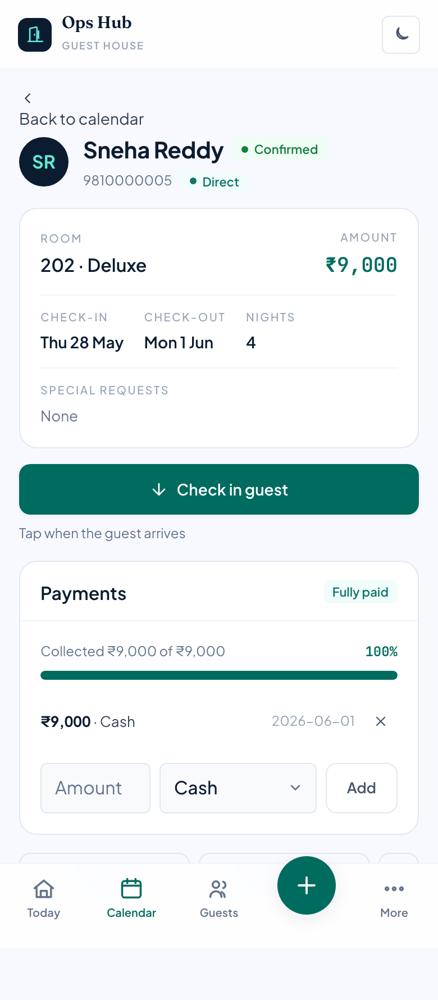

### Recording payments

On a booking, the payments panel shows what's been collected and the **balance due**. **Add payment** to record an amount and how it was paid (cash, UPI, card, bank, or collected by the OTA). Add several over time — a deposit now, the balance at check-in.

### Request payment by UPI

If you've set your **UPI ID** (Settings → Property), each unpaid booking shows a **Request ₹X via UPI** link and a **Show QR** button. Tap **Show QR** to display a scannable code the guest pays with any UPI app, or send the link — it's the balance, pre-filled. No gateway or account needed.

### Advance deposit

If a booking expects an **advance**, the panel shows an advance status — "Advance pending" until enough advance-tagged payments are in, then "Advance received". When you add a payment while an advance is owed, tick **Mark as advance deposit** so it counts toward it.

### Verifying UPI / bank payments

When you choose **UPI** or **bank transfer**, a short **verification checklist** appears (confirm the sender name, that the money actually landed, and the reference). Enter the **UTR / reference number** and tick each item — the **Add payment** button stays disabled until all are checked. This guards against fake-payment scams.

### Invoices

On a booking, tap **Invoice** for a clean bill with your property's name/address, the stay, charges, payments and balance. Tap **Print / Save PDF** and choose "Save as PDF" in the print dialog.

> The property name, address and GST number on the invoice come from Settings → Property — fill those in once.

## Guests

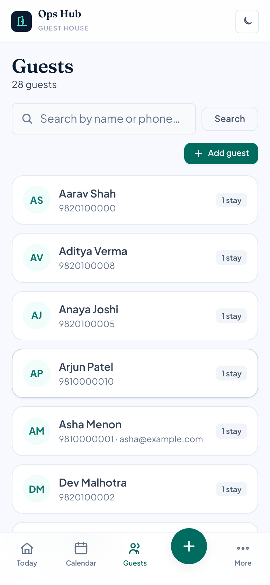

Search by name or phone. Each guest shows their number of stays, and badges for **Repeat** guests and **Blocked** (blacklisted) ones. Guests are shared across all your properties, so a returning guest is recognised wherever they book.

Open a guest to see:

- **Stays**, **lifetime value** (total spent), and a **Reliability** score derived from their no-shows. A guest who repeatedly fails to turn up shows a "Repeat no-show" badge, and the owner can raise a (shared) alert about them.
- Editable **name, email, ID number, address, vehicle number, notes** and **preferences/tags**.
- **ID & verification** — tick *ID checked*, *ID photocopied*, *verification completed*, and record the guest's *consent* to storing their details. These are what the check-in gate looks for.
- **Blacklist** toggle with a reason — this is what warns you at booking time.
- **ID document** — if document storage is set up, upload a scan/photo of their ID (kept private). Uploaded IDs can auto-expire after a retention period (Settings → Property).
- **Foreign-national details (C-Form)** — a collapsible section for overseas guests: nationality, passport, visa, and port + date of entry into India plus purpose of visit. Leave it closed/blank for Indian guests.
- **Stay history** — every past and upcoming booking; tap to open.

## Housekeeping

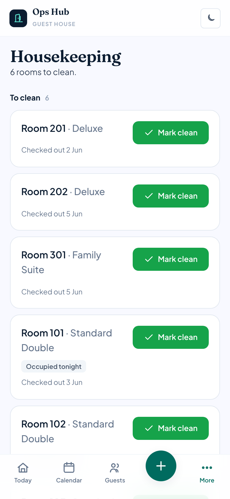

Two lists:

- **To clean** — rooms a guest has checked out of. A room with someone *arriving today* is flagged "clean first". Tap **Mark clean** when done.
- **Ready** — clean rooms. If a room needs attention even without a checkout, tap **Needs cleaning** to move it to the To-clean list.

## Inbox (OTA emails)

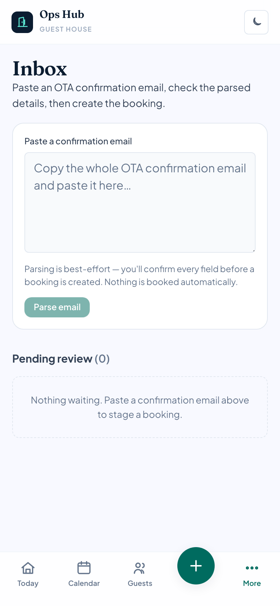

For bookings that arrive by email from Booking.com / Agoda / MakeMyTrip:

1. Copy the whole confirmation email and **paste it** into the box, then tap **Parse email**.
2. It appears under **Pending review** with the guest, dates and amount filled in as best it could.
3. **Check and correct** the details, pick the **room**, then tap **Create booking** — it's added to the calendar (and checked for clashes like any booking).
4. Not a real booking? **Dismiss** it. Need to see the original? **Show email**.

> Nothing is ever booked automatically — you always confirm. (Your tech team can later set this up to receive emails automatically; the review step stays the same.)

## Pricing & rates

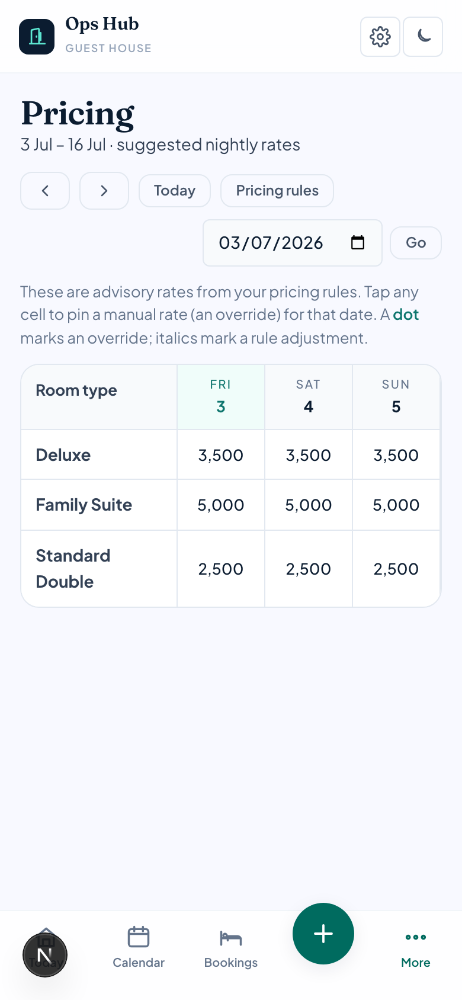

The **Pricing** screen shows a calendar of **suggested nightly rates** per room type. These are advisory — they help you decide and pre-fill new bookings; they are *not* sent to the OTAs.

- A rate in *italics* means a pricing rule adjusted it; a **dot** means you pinned a manual rate.
- **Tap any cell** to set a fixed price (an "override") for that room type on that date, or to clear it.
- Set the rules themselves in Settings → Pricing rules (weekend uplift, season/holiday ranges, early-bird / last-minute, and busy-period pricing). Every suggestion stays within each room type's floor and ceiling.

## Finance

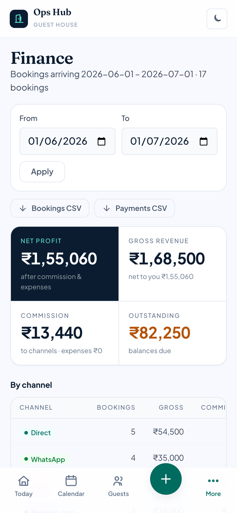

Pick a date range at the top. You'll see four tiles: **Net to you** (what's actually left, after commission and expenses), **Gross revenue**, **Commission**, and **Outstanding** (balances still owed).

- **By channel** — revenue, commission and net for each booking source.
- **Expenses** — tap **Add expense** to log a cost. These reduce net profit.
- **Balances due** — bookings still owing money; tap to open and record payment.
- **Bookings CSV** / **Payments CSV** — download spreadsheets for your accountant.

## Analytics

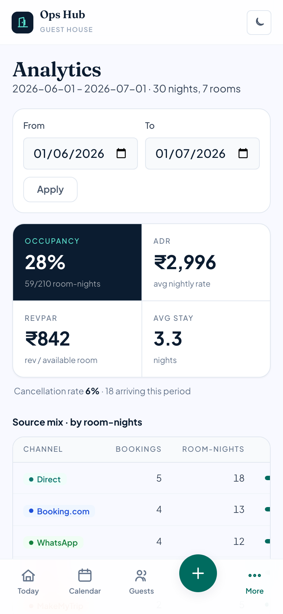

Performance over a period: **occupancy**, **ADR** (average nightly rate), **RevPAR** (revenue per available room), and your **channel mix** — useful for spotting trends and your best sources.

## Conflicts

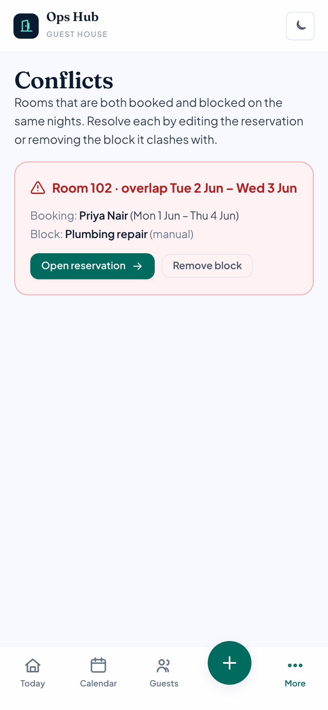

Lists any clashes that need a human decision — typically a manual block overlapping a stay. (Two confirmed bookings can never overlap; the app blocks that at the source.) Clear the list by removing the block or adjusting the booking.

## Channel feeds (iCal)

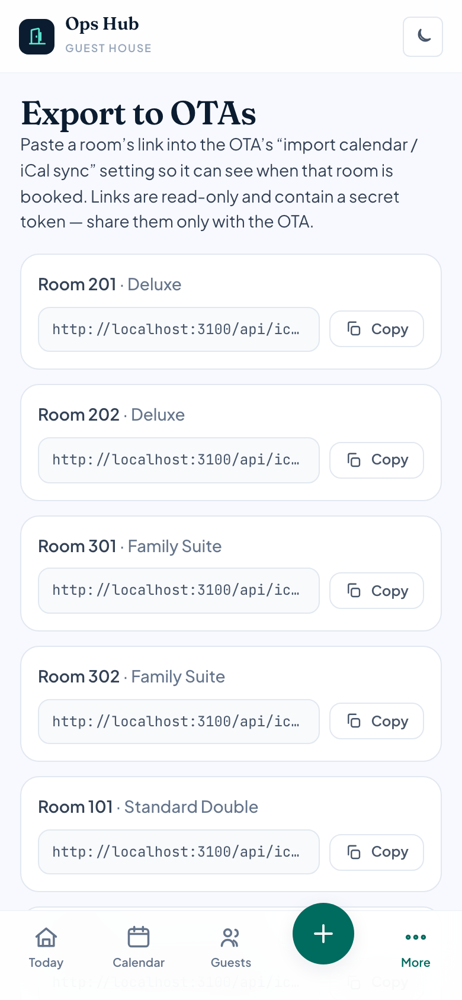

The **Feeds** screen keeps your calendars in sync with OTAs using free iCal links — no special accounts needed:

- **Import:** paste the iCal link an OTA gives you for a room. Their booked dates then show as *blocked* here, so you can't double-book. **Sync now** refreshes immediately; it also refreshes automatically once a day.
- **Export:** each room has a private `.ics` link you can give an OTA so *they* see your busy dates.

For the bigger picture of why this matters, see [Channels, OTAs & double-booking](#channels-otas--double-booking).

## All bookings (list)

The **Bookings** tab is a single searchable list of **every booking** — handy when you want to find one without hunting on the calendar.

- **Search** by guest name, phone, room, or channel — it filters instantly as you type.
- **Filter** with the tabs at the top: All / Upcoming / In-house / Past / Cancelled (each shows a count; cancelled and no-shows sit together under Cancelled).
- Each row shows the guest, channel, room, dates, nights and amount. **Tap any row** to open the booking.
- **+ New booking** in the corner starts a fresh booking.

## Travel agents

Manage the agents who bring you bookings on a B2B rate in **Settings → Travel agents**:

- Add an agent with a **name**, **phone**, and **commission %** (what you owe them — defaults to 10%). Mark one **verified** once you've confirmed who they are, or **deactivate** an agent you no longer work with.
- Each agent row shows how many bookings they've brought and the **commission owed this month** — worked out from their bookings, so you always know what to pay.

Attribute a booking to an agent on the booking form (the **Travel agent** picker). An agent is different from a **channel** (where a booking came from) and from a **referral** (a guest you send *out* to a peer — see [Community](#community-network)): an agent brings guests *in* and is a cost of sale.

## Escalations & Messages

> These two screens light up once your tech team connects the **AI assistant**. Until then they simply sit empty — nothing to do.

### Escalations

When an AI assistant hits something it shouldn't decide on its own — a special meal request, a complaint, a cab with no driver, or any action needing your approval (like cancelling a booking) — it **files an escalation** here instead of acting. The **Escalations** screen is your to-do queue:

- Items are tagged by **who raised it** (assistant / cab / front desk), **category**, and **severity**.
- Open one to read the guest's original message and the assistant's summary, then **act** — moving it through *open → in progress → resolved*.
- If it's linked to a booking, you do the actual change (e.g. the cancellation) through the normal booking screen — the assistant never touches money or the calendar itself.

### Messages

The **Messages** screen is an **outbox** — a log of every message the assistant or system has sent (or queued) to guests, with the channel (WhatsApp / SMS / email), who it went to, and the text.

The app already **drafts guest messages automatically**: a *booking confirmation* when a booking is made, a *pre-arrival note* the day before check-in, and *payment reminders* for balances still due. Today these are **logged** here for your records. Once your tech team connects a WhatsApp/messaging provider, the same drafts send for real — with no change to how you work — and this screen shows their delivery status.

## Team (Staff)

The **Staff** screen (in *More*, or the sidebar) is your team in one place:

- **Directory** — add each person with a **name, role** (Reception, Housekeeping, Cook, Delivery…) and **phone**. **Edit** to change details, **Disable** to retire them (keeps history), or delete.
- **Shift roster** — plan a shift: pick the person, a date, and start/end times.
- **Attendance** — for each active person, mark *present* / *absent* / *leave* for the day.

> Cleaning can be **assigned to a staff member** (with a checklist) from the Housekeeping screen, so you know who did what.

## Facilities — maintenance, stock, vendors, tours

Grouped under **Facilities** in the menu. Every list here has an **Edit** button on each row and a delete.

### Maintenance

- **Requests** — log what needs fixing with a **priority**, who's **assigned**, and a **cost**. Move each through *Open → In progress → Done*.
- **Asset register** — list equipment (geyser, generator, water pump…) with a "service every N days" schedule; the app flags one "Service due" when it's time, and **Serviced today** resets it.

### Inventory

Track supplies: add items with a **unit** and a **low-stock level**. Use **In** / **Out** to change the quantity; anything at or below its level is flagged "Low" and listed in a banner.

### Vendors & procurement

- **Vendors** — a directory with an optional rating.
- **Purchase orders** — record an order and move it *draft → ordered → received*.
- **Vendor payments** — record what you've paid. A summary shows ordered / received / paid / outstanding.

### Tours & activities

Offer sightseeing and treks: keep **partners/guides** (with a commission %), list the **tours** you offer, and **book a tour for a guest**. A summary totals bookings, revenue and the commission owed.

### Transport

Keep a record of **drivers** and **trips** (pickup, drop-off, fare, status). (Live cab dispatch is handled by the separate assistant service, not here.)

## Complaints, reviews & groups

### Complaints

The **Complaints** screen logs guest issues: record a complaint with a **category** and **priority**, assign it, and move it through to *resolved* with a follow-up. Filter by status to see what's still open.

### Reviews

The **Reviews** screen tracks review requests and their status, and lets you **draft a response**.

### Group & long-stay bookings

The **Groups** screen links several room bookings into one **folio** — for a group, a whole-property booking, or a long stay. Each room is still booked the normal way (and conflict-checked), then attached to the group so you can see and bill them together.

## Community network

> Everything here is **opt-in**. Nothing about your property is shared with anyone until *you* connect with them and choose exactly what to share. Your guests' private details and your finances are never shared.

A network of **trusted nearby properties** so you can help each other. Set it up in Settings → Trusted network:

- **Connect** with a peer using their **connect code**. Then, per peer, switch on what to share: *available rooms, referrals, scam numbers, bad-guest alerts, vendors, drivers*.
- **Directory** — find nearby properties by what they offer (parking, pets, airport pickup…). A peer's contact number appears once you're connected.
- **Referrals** — when you're full, refer the guest to a peer. They accept and book them (through the normal, conflict-checked path), the revenue is attributed, and a **reciprocal credit** balance builds between you.
- **Trusted lists** — vendors and drivers shared by properties in your network.
- **Shared scam & bad-guest alerts** — an opt-in, **verified** list. A report needs *evidence* before it can be shared, can be *disputed/appealed*, and *expires* automatically. Numbers are matched by a private code, never shared in the raw.

## Settings

Everything you set up once and rarely change:

| Section | What you manage |
|---|---|
| Properties | Add a property, or switch between the ones you run (owners with several guest houses). |
| Property | Name, address, GST number, check-in/out times, currency, your **UPI ID** for pay-links/QR, and the **ID rules** (how strictly ID is required at check-in — *block* / *warn* / *off*, whether an ID number is required to take a booking, and how long to keep scanned IDs before they auto-delete). |
| Users & roles | Add logins for your team and set each one's role — **owner**, **reception** or **housekeeping**. "Money only for owners." Owners with several properties can grant each login access per property. |
| Room types | Categories (Standard, Deluxe…) with base rate, max occupancy, and the rate floor/ceiling. |
| Rooms | Add a room, or **Archive** one to retire it (leaves the calendar, keeps history). Delete is only allowed for a room that was never booked. |
| Amenities | The facilities your property offers, used by the community directory. |
| Channels | Booking sources and their commission %. |
| Travel agents | Your verified B2B agents, their commission rate, and what you owe them (see [Travel agents](#travel-agents)). |
| iCal feeds | Import/export busy dates with OTAs (see [Channel feeds](#channel-feeds-ical)). |
| Pricing rules | Turn the engine on/off; weekend days & uplift; early-bird / last-minute; busy-period pricing; and a **Seasons & holidays** list of date ranges with adjustments. |
| Cancellation & refunds | Your **refund ladder** — how much a guest gets back by how far ahead they cancel (e.g. 100% at 30+ days, 75% at 20–29, 50% at 7–19, nothing inside a week). The refund is worked out for you on a cancelled booking; you can still approve a different amount. |
| Maintenance blocks | **Block a room** for a date range with a comment. Blocked dates can't be booked and show on the calendar. |
| Scam numbers | A list of **known-bad phone numbers** (with a reason). When one turns up on a new booking, the form warns you. |
| Community scam list / Bad-guest alerts | Report and verify shared scam numbers and evidence-backed bad-guest alerts. |
| Trusted network | Your **connect code**, invites, and per-peer sharing switches (see [Community network](#community-network)). |
| Import data | Bring past guests & bookings over from a CSV; each row is created like a normal, conflict-checked booking. |
| Audit log | A record of sensitive actions (cancellations, refunds, blacklisting, user & consent changes) — who did what, and when. |

## Channels, OTAs & double-booking

This section explains *why* the sync tools exist — useful for the owner and front desk. (For how to set the feeds up, see [Channel feeds](#channel-feeds-ical).)

**The core problem.** Each place you take bookings — your own website/WhatsApp, Booking.com, Agoda — keeps its **own** count of what's free. When someone books on your website, Booking.com's count *doesn't change* — it never saw that booking. So an OTA's picture is only correct if something keeps pushing your latest availability to it.

**How a double-booking happens:** 1 room left → a guest books it on your website (you now show 0, but nothing told Booking.com) → Booking.com still shows 1 → a second guest books it there → two guests, one room.

**The three ways to keep channels in sync:**

| Method | Real-time? | Prevents oversell? | Cost | Available to a single property? |
|---|---|---|---|---|
| Manual extranet updates | No — by hand | Only if you update instantly | Free | Yes |
| iCal calendar sync | No — every few hours | Partly — a lag window remains | Free | Sometimes (depends on listing type) |
| Channel manager | Yes — within seconds | Yes | Paid (monthly) | Yes — via the channel manager |

> **Why can't we just connect to Booking.com's API ourselves?** The official real-time connectivity APIs are granted **only to certified channel-manager partners**, not to individual properties. The channel manager is the licensed middleman.

**What iCal can and can't do.** iCal is a free, one-way "busy dates" feed (a `.ics` file at a URL) set up per room in the OTA extranet. You publish your room's link into their extranet (so they block your busy dates) and paste their link into the Feeds screen (so their bookings show as blocks here). Its limits: it's **not real-time** (refreshed every few hours, so a small double-booking window remains), it's **binary busy/free for a single unit** (it can't say "2 of my 3 Deluxe rooms are taken"), and it **only syncs availability** — not rates or guest details. Traditional multi-room hotel listings often don't get the iCal option at all — for those, an OTA expects a certified channel manager instead.

**Where this app fits.** It's deliberately **not** a channel manager (a single property can't be one). What it *does* give you: it's **internally bulletproof** (the database makes it impossible to double-book a room it knows about), it **brings OTA bookings in** (via the Inbox email paste and iCal import), and it's your **single source of truth** — every booking, direct or OTA, in one place. The honest limit: the free tools (iCal + email) aren't real-time, so a small residual window remains between your website and an OTA. Closing it *completely* needs a paid channel manager, which this app is designed to sit alongside.

**What to do:** make this app the single source of truth; check your OTA extranet for the iCal option and set up two-way sync if it's there; keep a safety buffer during busy periods (don't sell the very last room on OTAs); and if volume grows and double-bookings start costing money, pair one affordable channel manager.

## Tips & FAQ

### Common how-tos

- **Block a room for repairs:** Settings → Maintenance blocks → *Block a room*.
- **Mark someone arrived/left:** open their booking → *Check in* / *Check out*.
- **Give a guest a bill:** open the booking → *Invoice* → Print / Save PDF.
- **See who owes money:** Finance → Balances due.
- **Retire an old room:** Settings → Rooms → *Archive* (keeps its history).
- **Stop a problem guest sneaking back:** open the guest → turn on *Blacklist* with a reason.
- **Find any booking fast:** the *Bookings* tab → search by name, phone, room or channel.
- **Flag a scam phone number:** Settings → Scam numbers → add it with a reason.
- **Record a foreign guest's passport/visa (Form C):** open the guest → the *Foreign-national details* section.
- **Add a travel agent:** Settings → Travel agents → *Add travel agent*; then pick them on the booking form.
- **Send a guest a UPI pay request:** set your UPI ID in Settings → Property; the booking's payment panel then offers a tap-to-pay link and a **Show QR**.
- **Refer a guest when you're full:** *Referrals* → send them to a connected peer.

### Good to know

- **Nothing is ever double-booked** — the app prevents it.
- **Availability is always live** — worked out from your bookings and blocks, never a number that can drift.
- **Pricing is a suggestion** — it never changes prices on the OTAs by itself.
- **Cancelled bookings free their dates** immediately for re-booking.
- **ID is required to check a guest in** (unless the owner relaxes it in Settings → Property).
- **Patchy signal is fine** — changes you make offline are saved and sync automatically when you reconnect; if a booking clashed while you were offline, the app tells you.
- **What you can see depends on your role** — reception and housekeeping don't see money or setup.

---

*For setup, deployment and the technical reference, developers should see [README.md](../README.md) and the [docs/](.) folder. This guide covers day-to-day use only.*
